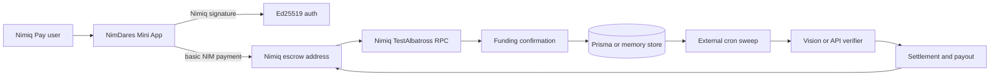
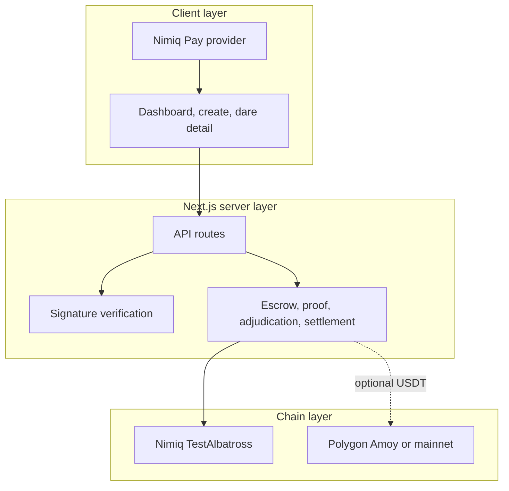

# NimDares


**Put real money behind the thing you said you would do.**

NimDares is a Nimiq Pay Mini App for commitment staking.

The user defines a measurable dare, locks NIM in escrow, submits screenshot evidence, and receives an adjudicated settlement.

Live frontend and API: [nimdares.vercel.app](https://nimdares.vercel.app) · On-chain network: Nimiq TestAlbatross testnet.

[Quickstart](#see-it-in-one-command) · [Architecture](#architecture) · [Safety](#safety-enforced-in-code) · [Demo](#the-one-flow-demo) · [Deploy](#deploy)

Built for the Nimiq Pay Mini Apps Competition Cycle 3 and released under the MIT license.

NimDares is a non-custodial application interface, not a bank, exchange, investment product, or source of financial advice.

## Table of Contents

- [See it in one command](#see-it-in-one-command)
- [Screenshots](#screenshots)
- [The one rule](#the-one-rule)
- [What NimDares does](#what-nimdares-does)
- [Architecture](#architecture)
- [Component by component](#component-by-component)
- [Safety, enforced in code](#safety-enforced-in-code)
- [How it uses Nimiq](#how-it-uses-nimiq)
- [Engineering decisions and the hard problems](#engineering-decisions-and-the-hard-problems)
- [What's real vs pending](#whats-real-vs-pending---the-honesty-table)
- [Tests](#tests)
- [Run it locally](#run-it-locally)
- [The one-flow demo](#the-one-flow-demo)
- [Configuration](#configuration)
- [Deploy](#deploy)
- [Project layout](#project-layout)
- [Tech stack, credits, and roadmap](#tech-stack-credits-and-roadmap)
- [Disclaimer and license](#disclaimer-and-license)

## See it in one command

### Backend and frontend

NimDares is a single Next.js application, so the API and frontend run from the same process.

```bash
cd NimDares
npm install
cp .env.example .env
PORT=3100 npm run dev
```

### Open the frontend

Open the app in a browser for UI development, or open the URL inside Nimiq Pay for real wallet signing.

```bash
cd NimDares
curl -I http://localhost:3100
open http://localhost:3100
```

Outside Nimiq Pay, the application can render the UI but cannot access the injected Nimiq wallet provider.

Inside Nimiq Pay, the wallet address, signing bridge, account snapshot, and basic NIM payment flow become available.

## Screenshots

The repository does not currently commit screenshots, so the live deployment is the canonical visual reference.

- [Open the live landing page](https://nimdares.vercel.app) - product explanation and commitment loop.
- [Open the live dashboard](https://nimdares.vercel.app/app) - wallet connection, dares, and arena feed.
- [Open the live create flow](https://nimdares.vercel.app/app/create) - commitment, mode, stake, and verifier setup.

## The one rule

**No dare becomes active until the exact stake is verified on-chain at the escrow address.**

The rule is enforced in three layers.

1. The client asks the wallet to send the exact amount with a `nimdares:` reference memo.
2. The API resolves the transaction from the Nimiq RPC and verifies recipient, value, execution result, payer attribution, and memo ownership.
3. The reconciliation and sweep paths can confirm a delayed deposit without trusting a client-supplied transaction hash.

This keeps UI state, database state, and escrow state separate until the chain proves the deposit.

## What NimDares does

### Solo commitments

Solo mode puts one user's stake behind one measurable commitment.

```text
create dare -> fund escrow -> submit proof -> adjudicate -> refund or slash
```

The solo path is the primary competition flow and supports a zero-sum refund for valid proof or a configured charity route for failed proof.

### Team rooms

Team mode creates a private room with a shareable room code and multiple seats.

```text
create private room -> join with code -> fund each seat -> settle winners and quitters
```

Each seat has its own participant record, stake amount, funding transaction, proof, verdict, and payout state.

### Arena rooms

Arena mode exposes a public room in the feed until its capacity is reached.

```text
create public room -> join while open -> fund seats -> distribute the pot
```

Arena rooms use the same escrow and adjudication engine as private rooms.

### Screenshot proof

The current create flow uses the VISION verifier and generates an evidence specification from the dare criteria.

```text
criteria -> evidence checklist -> screenshot upload -> structured verdict
```

The proof record stores the artifact, verifier state, confidence, observations, and reason used for settlement.

### GitHub and Strava adapters

The codebase includes GitHub and Strava verifier adapters for API-grounded evidence.

```text
proof link -> provider lookup -> deadline check -> normalized verdict
```

These adapters require their respective provider credentials and are not the default create-page verifier.

### Live NIM account reader

The Stake panel reads the connected Pay addresses against the configured Nimiq RPC.

```text
listAccounts() -> getAccountByAddress() -> basic balance in luna -> spendable NIM
```

The reader displays account type, raw balance, NIM balance, block height, and address so a locked HTLC balance cannot be mistaken for spendable basic-account funds.

## Architecture

Two decisions shape the system.

First, the application treats the blockchain as the authority for funding and settlement rather than trusting client state.

Second, all three room modes share the same data model and settlement engine, with `maxCapacity` and `isPrivate` determining the product behavior.





| Tier | Runs | Can it move funds? | Responsibility |
| --- | --- | --- | --- |
| Wallet provider | Inside Nimiq Pay | Yes, after user approval | Signs messages and basic NIM payments. |
| API routes | Vercel serverless functions | Yes, with escrow keys | Authenticates users and manages application state. |
| Reconciliation | API route or sweep job | No by itself | Matches confirmed chain deposits to dares and seats. |
| Adjudication | Sweep job | No by itself | Produces a structured verdict from proof. |
| Settlement | Sweep job and escrow signer | Yes | Sends refunds, payouts, charity transfers, or treasury transfers. |

## Component by component

### Frontend

| Module | Responsibility |
| --- | --- |
| `src/app/page.tsx` | Landing page and product explanation. |
| `src/app/app/page.tsx` | Wallet dashboard, user's dares, and arena feed. |
| `src/app/app/create/page.tsx` | Solo, team, and arena creation flow. |
| `src/app/app/dare/[id]/dare-detail.tsx` | Funding, room participation, proof submission, and status display. |
| `src/components/nimiq-provider.tsx` | Nimiq Pay provider bridge, account snapshots, signing, and payment calls. |
| `src/components/ui/` | HUD panels, buttons, status pills, motion primitives, and layout elements. |

### Backend

| Module | Responsibility |
| --- | --- |
| `src/app/api/auth/verify/route.ts` | Verifies Nimiq signatures and establishes user identity. |
| `src/app/api/dares/route.ts` | Creates and lists dares. |
| `src/app/api/dares/[id]/route.ts` | Reads a dare, participants, and settled state. |
| `src/app/api/dares/[id]/fund/route.ts` | Confirms a NIM payment against escrow. |
| `src/app/api/dares/[id]/join/route.ts` | Reserves room seats and validates room access. |
| `src/app/api/dares/[id]/proof/route.ts` | Accepts proof artifacts and starts proof intake. |
| `src/app/api/wallet/reconcile/route.ts` | Scans escrow deposits and refreshes the ledger. |
| `src/app/api/cron/sweep/route.ts` | Funds delayed deposits, adjudicates expired dares, and settles payouts. |
| `src/lib/db.ts` | Prisma-backed store with an in-memory development fallback. |
| `src/lib/verify.ts` | Nimiq signature parsing and address derivation. |
| `src/lib/escrow/` | NIM and Polygon escrow reads, transaction construction, and confirmation. |
| `src/lib/adjudicate.ts` | Dispatches proof to the configured verifier. |
| `src/lib/payout.ts` | Calculates and executes room settlement distributions. |

### Data

| Layer | Responsibility |
| --- | --- |
| `prisma/schema.prisma` | Persistent dares, participants, users, transactions, balances, and proof records. |
| Supabase Postgres | Production persistence when `DATABASE_URL` is configured. |
| Memory store | Local fallback when no database URL is available. |
| Nimiq RPC | Chain truth for account balances, transaction history, block height, and escrow deposits. |

## Safety, enforced in code

| Claim | How it is enforced |
| --- | --- |
| A client cannot mark a dare funded | Funding only becomes active after `confirmNimFunding` validates the chain transaction. |
| A payment cannot fund the wrong stake | Recipient, exact luna value, payer attribution, memo reference, and transaction claim are checked. |
| A deposit cannot fund two stakes | `findFundedByTxHash` rejects an already claimed transaction hash. |
| An unreadable wallet balance is not shown as zero | RPC read failures return `null`, while a real zero remains visibly distinguishable. |
| A locked contract balance is not treated as spendable | The client reads account type and only uses basic-account balance for affordability. |
| A user cannot submit unlimited failed proof | Proof intake caps attempts at `MAX_PROOF_ATTEMPTS`, currently three. |
| Cron settlement is protected | The sweep route accepts `Authorization: Bearer $CRON_SECRET` or `x-cron-secret`. |
| Secrets stay outside source control | `.env` is ignored and production values are stored in Vercel environment variables. |
| Payouts are not simulated silently | Missing escrow keys return explicit unavailable or pending states. |
| A solo loser route is explicit | Solo failure sends the stake to the configured charity address. |

## How it uses Nimiq

### Reads

- `listAccounts()` identifies the connected Pay address.
- `getAccountByAddress` reads the basic account and account type from the configured RPC.
- `getBlockNumber` reads the current chain head for transaction validity and diagnostics.
- `getTransactionsByAddress` scans escrow history using the lowercase hexadecimal address form required by the history RPC.
- `getTransactionByHash` verifies a wallet-returned transaction reference after broadcast.

### Writes

- Nimiq Pay signs the user authentication message.
- Nimiq Pay signs a basic NIM payment with a `nimdares:` memo.
- The server escrow key signs refunds, payouts, charity transfers, and treasury transfers when configured.
- The server broadcasts signed transactions through `sendRawTransaction`.

The active testnet escrow address is `NQ93 7600 V1VE K63J UQY4 6BS3 4M32 YAM0 GQHD`.

NimDares does not create or resolve user HTLC contracts.

The Nimiq Pay Mini App SDK currently exposes no HTLC refund API, so HTLC-held wallet value is not spendable by the basic payment path.

## Engineering decisions and the hard problems

**Chain truth beats optimistic UI.**

The UI can show a payment sheet, but the dare stays pending until the RPC confirms the exact deposit.

This avoids treating a wallet callback or a client-provided transaction hash as proof of escrow custody.

**Account balance means spendable balance.**

Pay can display aggregate wallet value while NIM is held in an HTLC or another contract account.

The app therefore shows account type, raw luna, and basic-account NIM instead of pretending the Pay portfolio total is spendable.

**One server handles all room modes.**

Solo, team, and arena differ through capacity and privacy flags rather than separate settlement implementations.

This keeps attribution, proof intake, and payout math consistent across the product.

**Delayed payments remain recoverable.**

The funding endpoint confirms an immediate payment, while the sweep route retries pending dares and room seats.

This protects payments that are valid but not yet indexed when the user returns from the wallet sheet.

**Public RPC usage is bounded.**

Account snapshots use a short cache, history scans cap confirmation work, and the sweep limits funding checks per run.

This reduces the chance that a group of viewers overwhelms the public testnet RPC.

**External cron is a deployment requirement on Vercel Hobby.**

The repository retains the ten-minute Vercel cron declaration, but the deployed Hobby project uses cron-job.org because Vercel Hobby rejects sub-daily cron schedules.

## What's real vs pending - the honesty table

| Capability | Status |
| --- | --- |
| Nimiq Pay wallet connection | Real - provider bridge, account listing, signing, and basic transfer methods are implemented. |
| Testnet NIM account reader | Real - reads the connected account from TestAlbatross RPC and displays account type and spendable balance. |
| NIM escrow funding | Real - deposits are verified against the configured escrow address and memo. |
| Signature authentication | Real - Nimiq signatures are verified server-side. |
| Solo dare lifecycle | Real - create, fund, proof, adjudication, and settlement paths exist. |
| Team and arena rooms | Real - room creation, capacity, room codes, seat funding, and shared settlement paths exist. |
| Vision adjudication | Real - requires `GEMINI_API_KEY` and an available Gemini model. |
| GitHub and Strava verification | Real - adapters exist, but each requires provider credentials and its supported evidence format. |
| Persistent production storage | Real - requires a configured `DATABASE_URL`; otherwise development uses memory. |
| Automated settlement sweep | Real - route exists and is protected by `CRON_SECRET`; external scheduling is required on Vercel Hobby. |
| Polygon USDT funding and payouts | Not yet established - code paths exist, but the current competition demo is NIM-first. |
| HTLC recovery from Nimiq Pay | Not yet established - the Mini App SDK does not expose HTLC refund methods. |
| Independent production security audit | Not yet established. |

The deployed system is honest about these boundaries instead of presenting missing keys, unavailable verifiers, or unscheduled jobs as successful infrastructure.

## Tests

| Suite | Tests count | Covers |
| --- | --- | --- |
| `scripts/e2e-api.mjs` | 42 assertions | Auth, create, list, ownership, reconcile, sweep, rooms, capacity, and join validation. |
| `scripts/e2e-adjudicate.mjs` | 11 assertions | Real Gemini adjudication behavior with configured credentials. |
| TypeScript build | Full project | Next.js production compilation and TypeScript validation. |
| ESLint | Repository lint | Source quality checks, with generated deployment artifacts excluded from normal source review. |

Run the API suite against a running server.

```bash
cd NimDares
npm run test:e2e
```

Run the adjudication suite only when `GEMINI_API_KEY` is configured.

```bash
cd NimDares
npm run test:adjudicate
```

Run the production checks directly.

```bash
cd NimDares
npx tsc --noEmit
npm run build
npm run lint
```

The current repository build passes TypeScript and production compilation.

The lint command may report existing warnings in the E2E script and should not be run over generated `.vercel/output` artifacts.

## Run it locally

### 1. Install dependencies

```bash
cd NimDares
npm install
cp .env.example .env
```

### 2. Start the application

```bash
cd NimDares
PORT=3100 npm run dev
```

The local server exposes both the frontend and API at `http://localhost:3100`.

### 3. Connect Nimiq Pay

Open the app URL inside Nimiq Pay with its TestAlbatross environment selected.

The browser outside Pay can exercise static UI routes, but wallet signing requires the injected Pay provider.

## The one-flow demo

1. Open the deployed NimDares URL inside Nimiq Pay.
2. Confirm the Wallet panel shows the connected address and `testnet` network.
3. Open **New dare**.
4. Enter a commitment such as `Merge a pull request`.
5. Write screenshot-checkable acceptance criteria, including a visible GitHub PR, a green Merged label, repository and PR number, merge hash and date, and the user's GitHub handle.
6. Select Solo mode, NIM, a 1 NIM stake, and a deadline within 90 days.
7. Confirm the live account reader shows a `basic` account with at least 1 NIM spendable.
8. Sign the dare creation message.
9. Approve the NIM payment to the displayed NimDares escrow through Nimiq Pay.
10. Wait for the funding confirmation to mark the dare active.
11. Complete the GitHub task before the deadline.
12. Submit a screenshot showing every acceptance criterion.
13. Run the external sweep job after the deadline or wait for its next scheduled execution.
14. Inspect the stored verdict and the on-chain refund or payout transaction.

Do not use a Pay account whose balance is locked in an HTLC, because a basic NIM payment cannot spend that contract balance.

## Configuration

### Backend variables

| Variable | Purpose |
| --- | --- |
| `DATABASE_URL` | Supabase or PostgreSQL connection string for persistent storage. |
| `GEMINI_API_KEY` | Gemini key for Vision adjudication and evidence specification. |
| `GEMINI_MODEL` | Optional Gemini model override. |
| `GITHUB_TOKEN` | Optional GitHub API verifier token. |
| `STRAVA_ACCESS_TOKEN` | Optional Strava verifier token. |
| `ESCROW_NIM_KEY_HEX` | NIM escrow signing key. Never commit this value. |
| `ESCROW_EVM_KEY_HEX` | Polygon escrow signing key for USDT paths. Never commit this value. |
| `CHARITY_WALLET_TESTNET` | Testnet destination for failed solo stakes. |
| `COMMUNITY_TREASURY_TESTNET` | Testnet destination for room pots without winners. |
| `TESTNET_TREASURY_KEY_HEX` | Optional testnet treasury signing key. Never use on mainnet. |
| `NIMIQ_NETWORK` | Server-side Nimiq network, `testnet` or `mainnet`. |
| `NIM_RPC_URL` | Optional server-side Nimiq RPC override. |
| `NIM_NETWORK_ID` | Nimiq network ID, `5` for TestAlbatross or `24` for mainnet. |
| `CRON_SECRET` | Bearer secret for the sweep endpoint. |
| `NIM_FEE_LUNA` | Optional NIM transaction fee override. |

### Frontend variables

| Variable | Purpose |
| --- | --- |
| `NEXT_PUBLIC_NIMIQ_NETWORK` | Client-visible Nimiq network, normally `testnet` for the demo. |
| `NEXT_PUBLIC_NIM_RPC_URL` | Optional browser-side Nimiq RPC override. |
| `NEXT_PUBLIC_NETWORK` | Polygon network, normally `amoy` or `mainnet`. |
| `NEXT_PUBLIC_EVM_RPC_URL` | Optional browser-side Polygon RPC override. |

Copy `.env.example` and keep `.env` out of Git.

## Deploy

### Vercel

The production deployment is [nimdares.vercel.app](https://nimdares.vercel.app).

Configure the production variables before deploying.

```bash
cd NimDares
vercel link
vercel env add DATABASE_URL production
vercel env add GEMINI_API_KEY production
vercel env add ESCROW_NIM_KEY_HEX production
vercel env add NIMIQ_NETWORK production
vercel env add NEXT_PUBLIC_NIMIQ_NETWORK production
vercel env add CRON_SECRET production
vercel --prod
```

Vercel Hobby rejects the repository's ten-minute cron declaration.

Deploy the application without the Vercel cron integration on Hobby, then schedule the endpoint externally.

### External sweep scheduler

Use cron-job.org or another authenticated HTTP scheduler.

Configure a ten-minute schedule with the following request:

```text
GET https://nimdares.vercel.app/api/cron/sweep
Authorization: Bearer <CRON_SECRET>
```

The route returns `403` when `CRON_SECRET` is configured and the bearer value is wrong.

The route returns sweep statistics after authentication and execution.

### Local production server

```bash
cd NimDares
npm run build
npm start
```

## Project layout

```text
NimDares/
├── prisma/
│   └── schema.prisma                 # Persistent data model
├── public/                           # Static assets
├── scripts/
│   ├── e2e-api.mjs                   # API lifecycle assertions
│   └── e2e-adjudicate.mjs            # Gemini adjudication assertions
├── src/
│   ├── app/
│   │   ├── page.tsx                  # Landing page
│   │   ├── app/page.tsx              # Dashboard and arena feed
│   │   ├── app/create/page.tsx       # Dare creation and NIM preflight
│   │   ├── app/dare/[id]/            # Dare detail and proof flow
│   │   └── api/                      # Next.js API routes
│   ├── components/
│   │   ├── nimiq-provider.tsx        # Nimiq Pay provider and account reader
│   │   └── ui/                       # Shared interface components
│   ├── generated/prisma/             # Generated Prisma client
│   └── lib/
│       ├── escrow/                   # NIM and EVM escrow logic
│       ├── adjudicate.ts             # Verifier dispatch
│       ├── db.ts                     # Prisma and memory stores
│       ├── payout.ts                 # Settlement math and payout calls
│       └── verify.ts                 # Signature authentication
├── .env.example                      # Environment variable template
├── next.config.ts                    # Next.js configuration
├── package.json                      # Scripts and dependencies
└── vercel.json                       # Cron declaration for Pro deployments
```

## Tech stack, credits, and roadmap

### Tech stack

- Next.js 16 App Router.
- React 19 and Motion.
- Tailwind CSS v4.
- Prisma 7 with PostgreSQL and an in-memory fallback.
- `@nimiq/mini-app-sdk` and `@nimiq/core`.
- Google Gemini through `@google/genai`.
- Polygon integration through ethers v6.
- Ed25519 signature verification through `@noble/ed25519`.

### Credits

NimDares uses the Nimiq Pay Mini Apps SDK and the official Nimiq TestAlbatross network.

The verification layer uses Google Gemini when the required API key is configured.

The product and implementation are maintained for the Nimiq Pay Mini Apps Competition Cycle 3.

### Roadmap

- Add a first-class HTLC status and recovery explanation for Pay users.
- Add a supported Nimiq HTLC refund workflow when the wallet provider exposes the required signing path.
- Complete production-grade Polygon USDT funding and settlement tests.
- Add committed visual regression screenshots.
- Add a hosted scheduler or move the sweep to a plan with native sub-daily cron support.
- Add independent security review for escrow signing and payout permissions.

## Disclaimer and license

NimDares is experimental software for testnet and competition use.

Do not use it with funds you cannot afford to lose, and do not treat displayed balances, adjudication results, or settlement previews as financial advice.

**License: MIT**
